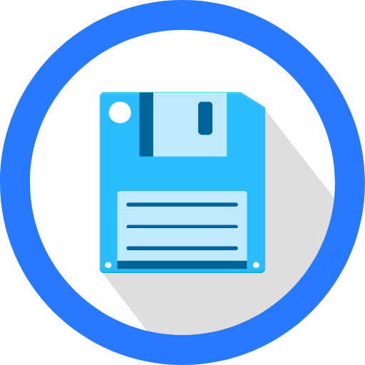

<p align="center">
  
</p>

# File Browser for StartOS

[File Browser](https://github.com/filebrowser/filebrowser) provides a simple file managing interface which can be used to upload, download, organize, edit, and share your files. It allows the creation of multiple users and each user can have their own directory. This repository creates the `s9pk` package that is installed to run `File Browser` on [StartOS](https://github.com/Start9Labs/start-os/).

## Dependencies

Prior to building the `ghost` package, it's essential to configure your build environment for StartOS services. You can find instructions on how to set up the appropriate build environment in the [Developer Docs](https://docs.start9.com/latest/developer-docs/packaging).

- [docker](https://docs.docker.com/get-docker)
- [docker-buildx](https://docs.docker.com/buildx/working-with-buildx/)
- [make](https://www.gnu.org/software/make/)
- [start-cli](https://github.com/Start9Labs/start-cli/)

## Cloning

Clone the File Browser package repository locally.

```
git clone git@github.com:Start9Labs/filebrowser-startos.git
cd filebrowser-startos
```

## Building

To build the **File Browser** service as a universal package, run the following command:

```
make
```

## Installing (on StartOS)

Before installation, define `host: https://server-name.local` in your `~/.startos/config.yaml` config file then run the following commands to determine successful install:

> :information_source: Change server-name.local to your Start9 server address

```
make install
```

**Tip:** You can also install the filebrowser.s9pk by sideloading it under the **StartOS > System > Sideload a Service** section.

## Verify Install

Go to your StartOS Services page, select **File Browser**, configure and start the service.

**Done!**
